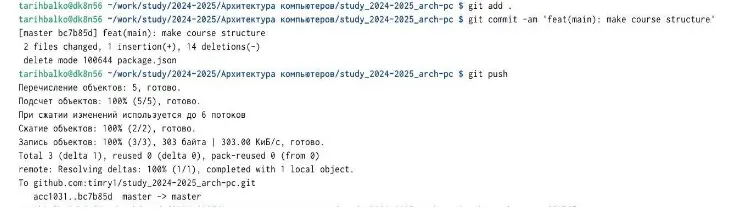

---
## Front matter
title: "Лабораторная работа №2"
subtitle: "Система контроля версий git"
author: "Рыбалко Тимофей Александрович"

## Generic otions
lang: ru-RU
toc-title: "Содержание"

## Bibliography
bibliography: bib/cite.bib
csl: pandoc/csl/gost-r-7-0-5-2008-numeric.csl

## Pdf output format
toc: true # Table of contents
toc-depth: 2
lof: true # List of figures
lot: true # List of tables
fontsize: 12pt
linestretch: 1.5
papersize: a4
documentclass: scrreprt
## I18n polyglossia
polyglossia-lang:
  name: russian
  options:
	- spelling=modern
	- babelshorthands=true
polyglossia-otherlangs:
  name: english
## I18n babel
babel-lang: russian
babel-otherlangs: english
## Fonts
mainfont: IBM Plex Serif
romanfont: IBM Plex Serif
sansfont: IBM Plex Sans
monofont: IBM Plex Mono
mathfont: STIX Two Math
mainfontoptions: Ligatures=Common,Ligatures=TeX,Scale=0.94
romanfontoptions: Ligatures=Common,Ligatures=TeX,Scale=0.94
sansfontoptions: Ligatures=Common,Ligatures=TeX,Scale=MatchLowercase,Scale=0.94
monofontoptions: Scale=MatchLowercase,Scale=0.94,FakeStretch=0.9
mathfontoptions:
## Biblatex
biblatex: true
biblio-style: "gost-numeric"
biblatexoptions:
  - parentracker=true
  - backend=biber
  - hyperref=auto
  - language=auto
  - autolang=other*
  - citestyle=gost-numeric
## Pandoc-crossref LaTeX customization
figureTitle: "Рис."
tableTitle: "Таблица"
listingTitle: "Листинг"
lofTitle: "Список иллюстраций"
lotTitle: "Список таблиц"
lolTitle: "Листинги"
## Misc options
indent: true
header-includes:
  - \usepackage{indentfirst}
  - \usepackage{float} # keep figures where there are in the text
  - \floatplacement{figure}{H} # keep figures where there are in the text
---

# Цель работы

Ознакомиться с работой git, выполнить задания в соответствии с лабораторной
работой, а также составить отчет по выполненной работе.

# Задание

1. Изучить документацию, приложенную к лабораторной работе
2. Настроить GitHub
3. Создать SSH ключ, а также рабочее пространство
4. Создание репозитория и настройка каталога курса
5. Выполнение заданий самостоятельной работы

# Теоретическое введение

{#fig:001 width=100%}
{#fig:001 width=100%}

# Выполнение лабораторной работы
1. В пункте 2.4.2 требуется сделать предварительную конфигурацию git (см рис.1)
{#fig:001 width=100%}

(Рис1)

2. В пунктах 2.4.3-2.4.4 требуется создать SSH ключ и рабочее пространство (см рис.2)
{#fig:001 width=100%}

(Рис2)

3. В пунктах 2.4.5-2.4.6 требуется создать репозиторий курса и настроить каталогкурса (см рис.3)
{#fig:001 width=100%}

(Рис3)

4. В пунктах 2.4.5-2.4.6 требуется создать репозиторий курса и настроить каталогкурса (см рис.4)
{#fig:001 width=100%}

(Рис4)

5. В пункте 2.5 требуется выполнить ряд самостоятельных заданий (см рис.5)
{#fig:001 width=100%}

(Рис5)

# Выводы

В процессе выполнения работы, я ознакомился с git. Изучил ряд команд, а также
подготовил рабочее пространство.

# Список литературы{.unnumbered}

Список литературы
1. GDB: The GNU Project Debugger. — URL: https://www.gnu.org/software/gdb/.
2.
GNU
Bash
Manual.
—
2016.—
—2021.
URL:
https://www.gnu.org/software/bash/manual/.
3.
Midnight
Commander
Development
Center.
—
URL:
https://midnight commander. org/.
4. NASM Assembly Language Tutorials. — 2021. — URL: https://asmtutor.com/.
5. Newham C. Learning the bash Shell: Unix Shell Programming. — O’Reilly
Media, 2005. — 354 с. — (In a Nutshell). — ISBN 0596009658. — URL:
http://www.amazon.com/Learningbash-Shell-Programming-
Nutshell/dp/0596009658.
6. Robbins A. Bash Pocket Reference. — O’Reilly Media, 2016. — 156 с. — ISBN
978- 1491941591.
7. The NASM documentation. — 2021. — URL: https://www.nasm.us/docs.php.
8. Zarrelli G. Mastering Bash. — Packt Publishing, 2017. — 502 с. — ISBN
9781784396879.
9. Колдаев В. Д., Лупин С. А. Архитектура ЭВМ. — М. : Форум, 2018.
10. Куляс О. Л., Никитин К. А. Курс программирования на ASSEMBLER. —
М. : Солон-Пресс, 2017.
11. Новожилов О. П. Архитектура ЭВМ и систем. — М. : Юрайт, 2016.
1
2 Робачевский А., Немнюгин С., Стесик О. Операционная система UNIX. —
13.
2.
- Столяров А. Программирование на языке ассемблера NASM для ОС Unix.
14.
еР
—
а Таненбаум Э. Архитектура компьютера. — 6-е изд. — СПб. : Питер, 2013.
15.
с 874 с. — (Классика Computer Science). 16. Таненбаум Э., Бос Х.
2и
—
-зш
и
ед
.р
12Современные операционные системы. — 4-е изд. — СПб. : Питер, 2015. —
1120 с. — (Классика Computer Science).
