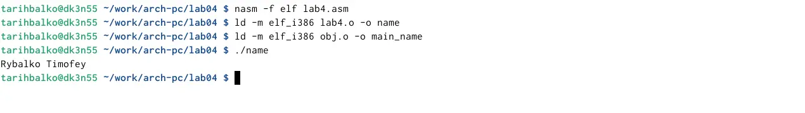

---
## Front matter
title: "Отчет по лабораторной работе №4"
subtitle: "Создание и процесс
обработки программ на языке ассемблера NASM"
author: "Рыбалко Тимофей Александрович"

## Generic otions
lang: ru-RU
toc-title: "Содержание"

## Bibliography
bibliography: bib/cite.bib
csl: pandoc/csl/gost-r-7-0-5-2008-numeric.csl

## Pdf output format
toc: true # Table of contents
toc-depth: 2
lof: true # List of figures
lot: true # List of tables
fontsize: 12pt
linestretch: 1.5
papersize: a4
documentclass: scrreprt
## I18n polyglossia
polyglossia-lang:
  name: russian
  options:
	- spelling=modern
	- babelshorthands=true
polyglossia-otherlangs:
  name: english
## I18n babel
babel-lang: russian
babel-otherlangs: english
## Fonts
mainfont: IBM Plex Serif
romanfont: IBM Plex Serif
sansfont: IBM Plex Sans
monofont: IBM Plex Mono
mathfont: STIX Two Math
mainfontoptions: Ligatures=Common,Ligatures=TeX,Scale=0.94
romanfontoptions: Ligatures=Common,Ligatures=TeX,Scale=0.94
sansfontoptions: Ligatures=Common,Ligatures=TeX,Scale=MatchLowercase,Scale=0.94
monofontoptions: Scale=MatchLowercase,Scale=0.94,FakeStretch=0.9
mathfontoptions:
## Biblatex
biblatex: true
biblio-style: "gost-numeric"
biblatexoptions:
  - parentracker=true
  - backend=biber
  - hyperref=auto
  - language=auto
  - autolang=other*
  - citestyle=gost-numeric
## Pandoc-crossref LaTeX customization
figureTitle: "Рис."
tableTitle: "Таблица"
listingTitle: "Листинг"
lofTitle: "Список иллюстраций"
lotTitle: "Список таблиц"
lolTitle: "Листинги"
## Misc options
indent: true
header-includes:
  - \usepackage{indentfirst}
  - \usepackage{float} # keep figures where there are in the text
  - \floatplacement{figure}{H} # keep figures where there are in the text
---

# Цель работы

Освоение процедуры компиляции и сборки программ, написанных на ассемблере NASM.
# Задание
1. Программа Hello world!
  1.1 создать каталог для работы с программами на языке ассемблера NASM
  1.2 перейти в созданный каталог
  1.3 создать текстовый файл с именем hello.asm
  1.4 открыть этот файл
  1.5 ввести в него указанный текст
2. Транслятор Nasm
  2.1 выполнить комппиляцию в объектный код
3. Расширенный синтаксис
  3.1 выполнить компиляцию исходного файла
4. Компановщик LD
  4.1 передать объектный файл на обработку компановщику
5. Запустить исполняемый файл
6. Задания для самостоятельной работы
  6.1 создать копию файла hello.asm с именем lab4.asm
  6.2 изменить скопированный файл, чтобы выводилась строка с именем и
фамилией
  6.3 оттранслировать полученный текст программы lab4.asm в объектный
файл
  6.4 скопировать файлы hello.asm и lab4.asm в локальный репозиторий
# Теоретическое введение
В процессе создания ассемблерной программы можно выделить четыре шага:
• Набор текста программы в текстовом редакторе и сохранение её в отдельном
файле. Каждый файл имеет свой тип (или расширение), который определяет
назначение файла. Файлы с исходным текстом программ на языке ассемблера
имеют тип asm.
• Трансляция — преобразование с помощью транслятора, например nasm, текста
программы в машинный код, называемый объектным. На данном этапе также
может быть получен листинг программы, содержащий кроме текста программы
различную дополнительную информацию, созданную транслятором. Тип объ-
ектного файла — o, файла листинга — lst.
• Компоновка или линковка — этап обработки объектного кода компоновщиком
(ld), который принимает на вход объектные файлы и собирает по ним исполняе-
мый файл. Исполняемый файл обычно не имеет расширения. Кроме того, можно
получить файл карты загрузки программы в ОЗУ, имеющий расширение map.
• Запуск программы. Конечной целью является работоспособный исполняемый
файл.
Ошибки на предыдущих этапах могут привести к некорректной работе програм-
мы, поэтому может присутствовать этап отладки программы при помощи специ-
альной программы — отладчика. При нахождении ошибки необходимо провести
коррекцию программы, начиная с первого шага.

# Выполнение лабораторной работы
1. Программа Hello world! (См Рис 1)
{#fig:001 width=100%}

(Рис1)

2. Создать каталог для работы с программами на языке ассемблера NASM, перейти в него и создать текстовый файл с именем hello.asm и открыть этот файл (См Рис 2)

{#fig:001 width=100%}

(Рис2)

3. Открыть этот файл(См Рис 3)
{#fig:001 width=100%}

(Рис3)

4. Ввести в него указанный текст
5. Транслятор Nasm (См Рис 4)
{#fig:001 width=100%}

(Рис4)

6. Выполнить компеляцию в объектный код, расширенный синтаксис (См Рис 5)
{#fig:001 width=100%}

(Рис5)

7. Выполнить компеляцию исходного файла, далее компановщик LD и передача объектного файла на обработку компановщику (См Рис 6)
{#fig:001 width=100%}

(Рис6)

8. Запустить исполняемый файл (См Рис 7)
{#fig:001 width=100%}

(Рис7)

9. Задания для самостоятельной работы 

10. Переходим в папку lab04 и создаем копию файла hello.asm с именем lab4.asm (См Рис 8)
{#fig:001 width=100%}

(Рис8)

11. Изменяем скопированный файл, чтобы выводились имя и фамилия, далее надо оттранслировать полученный текст программы labs4.asm в объектный файл (См Рис 9)
{#fig:001 width=100%}

(Рис9)

12. Скопировать файлы hello.asm и labs4.asm в локальный репозиторий.

# Выводы
Я ознакомился с созданием и процессом обработки программ на языке ассем-
блера NASM

# Список литературы{.unnumbered}
1. GDB: The GNU Project Debugger. — URL: https://www.gnu.org/software/gdb/.
2. GNU Bash Manual. — 2016. — URL: https://www.gnu.org/software/bash/manual/.
3. Midnight Commander Development Center. — 2021. — URL: https://midnight-commander.
org/.
4. NASM Assembly Language Tutorials. — 2021. — URL: https://asmtutor.com/.
5. Newham C. Learning the bash Shell: Unix Shell Programming. — O’Reilly Media, 2005. —
354 с. — (In a Nutshell). — ISBN 0596009658. — URL: http://www.amazon.com/Learning-
bash-Shell-Programming-Nutshell/dp/0596009658.
6. Robbins A. Bash Pocket Reference. — O’Reilly Media, 2016. — 156 с. — ISBN 978-1491941591.
7. The NASM documentation. — 2021. — URL: https://www.nasm.us/docs.php.
8. Zarrelli G. Mastering Bash. — Packt Publishing, 2017. — 502 с. — ISBN 9781784396879.
9. Колдаев В. Д., Лупин С. А. Архитектура ЭВМ. — М. : Форум, 2018.
10. Куляс О. Л., Никитин К. А. Курс программирования на ASSEMBLER. — М. : Солон-Пресс,
2017.
11. Новожилов О. П. Архитектура ЭВМ и систем. — М. : Юрайт, 2016.
12. Расширенный ассемблер: NASM. — 2021. — URL: https://www.opennet.ru/docs/RUS/nasm/.
13. Робачевский А., Немнюгин С., Стесик О. Операционная система UNIX. — 2-е изд. — БХВ-
Петербург, 2010. — 656 с. — ISBN 978-5-94157-538-1.
14. Столяров А. Программирование на языке ассемблера NASM для ОС Unix. — 2-е изд. —
М. : МАКС Пресс, 2011. — URL: http://www.stolyarov.info/books/asm_unix.
15. Таненбаум Э. Архитектура компьютера. — 6-е изд. — СПб. : Питер, 2013. — 874 с. —
(Классика Computer Science).
16. Таненбаум Э., Бос Х. Современные операционные системы. — 4-е изд. — СПб. : Питер,
2015. — 1120 с. — (Классика Computer Science).

